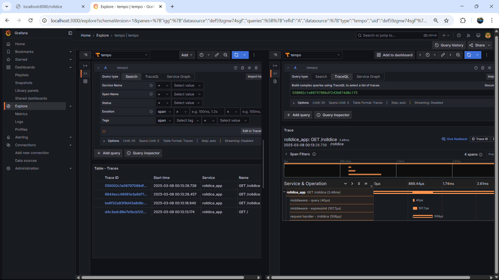

# Fetching traces using Jaeger and Tempo via OpenTelemetry Collector

Note: I am using WSL2 on my windows 11 Laptop. I have tried running it on 'git bash' through my windows machine but I was getting errors which was affecting my productivity.

Before following all the steps it's recommended to give the name to the service.
`export OTEL_SERVICE_NAME=rolldice-app`. Otherwise, it will show the path where jaeger resides.


## Implementing Jaeger for fetching Traces

1. Running jaeger beforehand because opentelemetry depends on it.
Jaeger command:
```
docker run -d --name jaeger \
  --env COLLECTOR_ZIPKIN_HOST_PORT=:9411 \
  --env COLLECTOR_OTLP_ENABLED=true \
  --publish 16686:16686 \
  --network otel-jaeger-network \
  --network-alias jaeger \
  jaegertracing/all-in-one:latest

  OR
  
  Just run docker-compose up -d by commenting out tempo and grafana

```

2. Running Open Telemetry using the command mentioned it its documentation itself. I just have added network and name parameter from my side

```
docker run --name otel-collector \
-v $(pwd)/collector-config.yaml:/etc/otelcol/config.yaml \
-p 4317:4317 --rm \
--network otel-jaeger-network \
otel/opentelemetry-collector

OR docker-compose command will do.
```
3. Finally, run the node command to get the traces to jaeger 

```
node --require ./instrumentation.js app.js
OR docker-compose command, Image of size 318.49 MB will be created
```

Final results,
1. Jaeger UI


2. Open Telemetery collector logs


## Implementing Grafana Tempo for fetching Traces

- Basic idea is,
  - We will keep the Nodejs instrumented application as it is.
  - Second thing, we need to update `collector-config.yaml` and configure the endpoint where tempo will be accessible by otel collector
  - Lastly, we will configure `tempo.yaml` where we will configure that, the tempo will listen on which port and where its storage will be. Either on cloud(gcs, s3, etc..) or local(in our case)

## Important Note to read before Hands-on

  1. We need to make sure in tempo.yaml we set the endpoint to 0.0.0.0 and not localhost(127.0.0.1). Otherwise, otel might not be able to reach tempo and show this error

  ```
  2025-03-07 23:36:29 2025-03-07T18:06:29.198Z    warn    grpc@v1.70.0/clientconn.go:1381 [core] [Channel #1 SubChannel #2]grpc: addrConn.createTransport failed to connect to {Addr: "tempo:4317", ServerName: "tempo:4317", }. Err: connection error: desc = "transport: Error while dialing: dial tcp 172.23.0.2:4317: connect: connection refused"{"grpc_log": true}

  Hence,
  grpc:
    endpoint: 0.0.0.0:4317 in tempo.yaml
  ```

  2. Also, we also need to make sure that, we mount our directory(which tempo will create) in docker-compose file. Basically, add this line.
  ```
  - ./tempo-data:/tmp/tempo/traces
  ```
  and give it the write permission. I have given the root permission to make my project running.
  ```
  # This command will make us the owner of the directory. Earlier it was root
  sudo chown -R $USER:$USER ./tempo-data/
  
  # This command gives us read, write and execute permission for everyone.
  chmod -R 777 ./tempo-data/

  Information:
    - 7 -> Read, Write and Execute for User
    - 7 -> Read, Write and Execute for Group
    - 7 -> Read, Write and Execute for Others
  - If we keep it 700, i.e. we're giving permission to User only and so on.
  ```

Things yet to be done,
- Add Prometheus and enable Monitor Tab in Jaeger

### Let's implement now

1. In `docker-compose.yaml` comment out the Jaeger service
2. In `collector-config.yaml` comment out the jaeger service and remove the reference to it too.

3. Run `docker-compose up -d` and the application will be up and running.

4. Now, access Grafana on port 3000
5. Add Tempo as a Data Source -> Add this url 'http://tempo:3200'
6. Go to Explore
7. Select Tempo as Data source and Click on Serch and go ahead and see the traces

